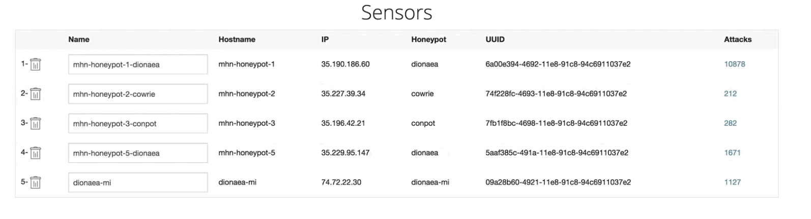
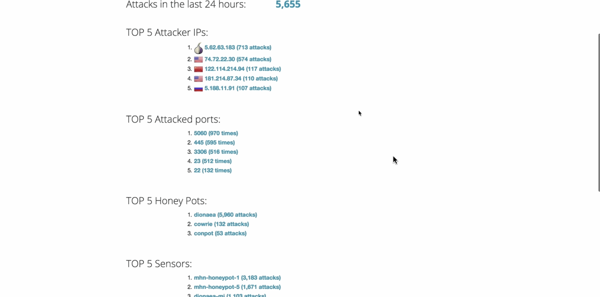

# Web-Security-Week9

## Which Honeypot(s) you deployed

## Any issues you encountered
I had a hard time to figure out how to set up MHN Admin VM and deploy honeypot under the instruction of CodePath.

## A summary of the data collected: number of attacks, number of malware samples, etc.

*Table 1 - Top 5 Attacker IPs*

| No. | IP | Location | Attacks |
|:---:|:--:|:--------:|:-------:|
| 1 | 5.62.63.183 | Tor network | 680 |
| 2 | 74.72.22.30 | U.S | 574 |
| 3 | 122.114.214.94 | China | 117 |
| 4 | 5.188.11.91 | Russia | 104 |
| 5 | 181.214.87.34 | U.S | 103 |

*Table 2 - Top 5 Attacked Ports*

| No. | Port | Attacks |
|:---:|:----:|:-------:|
| 1 | 5060 | 931 |
| 2 | 445 | 573 |
| 3 | 3306 | 516 |
| 4 | 23 | 490 |
| 5 | 22 | 129 |

## Any unresolved questions raised by the data collected
How do I determine which attack is a malware?
